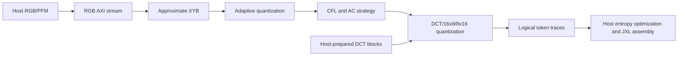

# HJXL quality assessment — 2026-07-12

> Consolidated review refreshed through 2026-07-16. Commit `51894ae`
> (`docs: consolidate project quality assessment`) established the compact
> baseline; this revision includes the guarded-analysis-DCT checkerboard parity
> follow-up. The filename preserves the original requested assessment date.

## Executive summary

`hjxl` is a thoughtfully designed, verification-led RTL research project. Its
trace-first decomposition, prepared-data boundaries, fixed-point reference
models, and unusually deep protocol/oracle tests make it substantially better
engineered than its current product completeness might suggest.

It is not yet a complete JPEG XL encoder or a demonstrated FPGA accelerator.
The most reliable path begins with host-prepared DCT coefficients; the most
complete RGB path reaches adaptive DCT/16x8/8x16 logical tokens, but only three
small nonzero images have exact end-to-end token and codestream parity. Final
entropy optimization and bitstream assembly remain in host software. More
importantly, no Vivado synthesis, utilization, timing, power, place-and-route,
bitstream, DMA, or KV260 execution result exists.

The central architectural tension is clear:

- As a correctness laboratory, the full-frame buffers, many focused wrappers,
  and common `StageTrace` interface are effective. They make the earliest
  mismatch observable and allow each downstream stage to mature independently.
- As an FPGA architecture, the same choices do not yet scale. The default
  maximum frame is 32x32, whole-frame `Reg(Vec(...))` storage is widespread,
  several datapaths are large or combinational, and the focused RGB VarDCT top
  emits more than 135,000 lines of SystemVerilog before synthesis.

### Overall judgment

| Perspective | Assessment |
| --- | --- |
| Scope discipline and architectural intent | **Very good** |
| Verification of implemented logical behavior | **Very good** |
| Primitive-level RTL quality | **Good** |
| Frame-level maintainability | **Moderate and declining as wrappers multiply** |
| Host/RTL contract quality | **Good** |
| Documentation accuracy | **Good and candid; information architecture needs work** |
| Completeness versus the stated `libjxl-tiny` target | **Partial** |
| FPGA implementation readiness | **Early** |
| Release/multi-contributor readiness | **Early to moderate** |

An indicative score is **6.5/10 overall**: about 8/10 as a traceable RTL
exploration environment, but 2–3/10 as a demonstrated FPGA JPEG XL encoder.
The gap is evidence and architecture for physical realization, not a lack of
care in the code already present.

## Scope and method

This review covers the current implementation through the guarded-analysis-DCT
checkerboard follow-up, including:

- repository history, worktree state, build definitions, CI, ignore rules,
  license, and generated-file policy;
- all main/test/tool inventories and detailed reading of configuration,
  bundles, core routing, adaptive quantization, CFL, strategy selection,
  ordinary and rectangular DCT/quantization, tokenization, frame schedulers,
  AXI-stream/AXI-Lite shells, discovery, the KV260 wrapper, and elaborators;
- representative primitive, scheduler, protocol, elaboration, host-tool,
  oracle, codestream, capacity-edge, and throughput tests;
- the generated ABI schema and bindings, manifest/bundle/replay tools, Vivado
  preflight, README, architecture guide, performance notes, and agent guide;
- static searches for large modules, frame-scaled registers, synchronous
  memories, assertions, incomplete functionality, and missing quality gates;
- the checked-out `libjxl-tiny` integration and the CI pin used to reproduce it.

Snapshot size at the reviewed commit:

| Area | Files | Lines |
| --- | ---: | ---: |
| Main Scala/Chisel | 70 | 17,948 |
| Scala tests | 72 | 28,654 |
| Python host/oracle tools | 18 | 14,708 |
| `README.md`, `docs/architecture.md`, and `AGENTS.md` | 3 | 4,416 |

The test-to-RTL ratio is a genuine strength. It also shows where complexity has
moved: the host/oracle layer is nearly as large as the RTL, and the test layer
is roughly 1.6 times the main Scala source.

## Product and architecture

### Intended split

The project deliberately targets the lossy VarDCT subset represented by
`libjxl-tiny`, not full JPEG XL. The host decodes images and currently performs
entropy optimization and final bitstream assembly; RTL accelerates traceable,
deterministic image, transform, quantization, and logical-token stages.

This is a sensible staging strategy. It creates useful intermediate milestones
without pretending that approximate RGB stages are exact merely because a
final file was produced.

### What the architecture gets right

1. **Traceability is a first-class contract.** `StageTrace` supplies one
   stage/group/index/value vocabulary, and `traceLast` supplies an explicit
   accepted-frame boundary. The project can compare the earliest divergent
   stage instead of debugging opaque byte mismatches.

2. **Prepared boundaries isolate uncertainty.** Prepared DC, AC, metadata,
   DCT, CFL, quantization, and variable-shape token paths let downstream RTL be
   exact while RGB/XYB/AQ precision evolves. This is the strongest recurring
   design pattern in the repository.

3. **The hardware/software boundary is pragmatic.** Keeping entropy coding in
   software avoids blocking useful transform/quantization experiments. The
   documentation clearly distinguishes logical-token parity from an all-RTL
   encoder.

4. **Protocol behavior is designed, not incidental.** Stream packing, the
   201-word prepared-block ABI, final-only TLAST, full-word TKEEP, sticky
   protocol errors, busy/overflow, unsupported-distance fallback, byte-strobed
   AXI-Lite writes, and error clearing are specified and tested.

5. **Heavy paths are compile-time selectable.** The default core avoids
   elaborating every expensive route. Focused tops make simulation and
   generated-RTL inspection tractable.

6. **Cross-language ABI drift has a real control point.**
   [`abi/hjxl_abi.json`](../abi/hjxl_abi.json) generates checked Scala and
   Python constants for register geometry, trace packing, stages, discovery,
   and prepared stream layout. CI rejects stale generated bindings.

7. **The first physical target is explicitly frozen.**
   `HjxlKv260PreparedDctTop`, not the larger RGB/estimated-CFL variants, is the
   chosen first synthesis target. That is the right risk-reduction decision.

### Architectural risks

1. **The validation architecture is not yet a scalable FPGA architecture.**
   The reviewed RTL contains 108 frame/block `Reg(Vec(...))` or
   `RegInit(VecInit(...))` sites and only three `SyncReadMem` sites. Several
   schedulers retain full RGB frames, XYB planes, DCT blocks, maps, metadata,
   prediction grids, or token state. Increasing the configured capacity scales
   state rapidly and may prevent useful-image elaboration or synthesis.

2. **Most frame paths are batch schedulers, not steady-state pipelines.** Data
   is commonly received, stored, processed, and then emitted. `Decoupled`
   interfaces provide local backpressure safety, but they do not establish a
   macro-level pixels-per-cycle or blocks-per-cycle pipeline. Acquisition,
   compute, and output overlap remains limited and content-dependent.

3. **Physical arithmetic cost is largely unknown.** The design includes large
   DCT networks, wide products, square-root logic, lookup tables, restoring
   dividers, and some dynamic or constant division. The code is thoughtful
   about Q formats and functional rounding, but Verilator and FIRRTL acceptance
   say nothing about DSP mapping, critical paths, fanout, or routing.

4. **Focused routes trade area for verification convenience.** The RGB VarDCT
   path carries Q12 and Q16 precision, stores frame data, evaluates eight
   strategy candidates, recomputes selected rectangular transforms, and feeds
   variable-shape quantization/tokenization. Its analysis-only guard-bit DCT
   fixes checkerboard CFL/scoring without perturbing quantization, but adds
   three more transform specializations. This is defensible for parity closure
   and should still be treated as an experiment, not the final physical
   organization.

5. **Route selection has two overlapping mechanisms.** Compile-time
   `traceRoute` controls elaboration while runtime feature flags and
   `tokenSelect` feed a priority tree in `HjxlCore`. Discovery makes the active
   route visible and configuration is frame-stable, but an explicit runtime
   route field would be clearer than treating feature enables as both behavior
   flags and route selectors.

6. **Configuration commit is implicit.** Stream shells snapshot configuration
   on the first accepted input beat; writes while busy become next-frame shadow
   values. This is internally consistent and tested, but an eventual DMA
   driver may benefit from an explicit start/commit sequence.

7. **The architecture has no end-to-end memory/transport model.** There is no
   agreed ownership model for input buffers, intermediate tiles, output rings,
   DMA descriptors, cache coherency, or host/PL overlap. Those decisions will
   strongly constrain which current frame stores survive.

## Codebase structure and implementation quality

### Strengths

- Names map closely to `libjxl-tiny` concepts, and module comments usually say
  both what a block implements and what it intentionally omits.
- Small arithmetic primitives are separated from frame schedulers and receive
  direct tests. DCT, CFL weighting/fitting, distance lookup, quantization
  components, strategy scoring, scan orders, token packing, and tile geometry
  are understandable in isolation.
- Fixed-point formats, signedness, rounding, clamping, and fallback behavior
  are normally explicit. Approximate stages use bounded tolerances; claimed
  integer/token boundaries use exact equality.
- Important capacity calculations use carry-preserving `+&`, including 72-pixel
  non-aligned regressions that would expose lost-carry ceil-division bugs.
- Ready/valid stability is handled seriously. Many tests deliberately stall
  outputs and verify that trace data and final markers remain stable.
- The direct prepared-DCT path has begun replacing duplicate register planes
  with ownership-aware streaming and synchronous coefficient storage. That is
  the right refactoring direction.
- Fifty-four in-RTL assertions now protect selected arithmetic, traversal, and
  variable-shape invariants. This is useful even though coverage is uneven.

### Maintainability concerns

- **The package is flat.** All 70 main source files and 72 test files live in
  `hjxl`. The many `FramePrepared*`, `FrameAq*`, DCT-only, estimated-CFL,
  stream, controlled-stream, and KV260 variants are increasingly hard to map.
  Subpackages such as `arithmetic`, `stages`, `prepared`, `interfaces`, and
  `tops` would make ownership clearer.
- **Several modules are too large.** At the reviewed commit,
  `FramePreparedAcStrategyTraceStage.scala` is 795 lines,
  `FrameAqDctOnlyQuantizeTraceStage.scala` is 675,
  `QuantizeDct8x8Block.scala` is 666, `QuantizeVarDctBlock.scala` is 645,
  `Elaborate.scala` is 641, and `HjxlCore.scala` is 529. These files combine
  storage, traversal, arbitration, arithmetic, and protocol responsibilities.
- **The wrapper matrix is partly combinatorial.** Each new route can require a
  scheduler, trace wrapper, core route, stream wrapper, controlled wrapper,
  elaborator, generated directory, port regression, and documentation update.
  `Elaborate.scala` and `HjxlCore` expose this mechanical growth directly.
- **Frame geometry and lifecycle logic repeat.** Ceil division, bounds,
  frame-active state, raster ordinals, tile ordinals, overflow, and reset logic
  recur in many schedulers. `CflTileGeometry` and the shared coefficient stores
  show how more of this could be centralized.
- **Assertions are not systematic.** There are useful local checks, but no
  standard invariant set for every `Decoupled` endpoint, frame FSM, final-beat
  relationship, index bound, or reset/recovery transition.
- **Style is enforced by convention.** There is no Scala formatter/linter,
  Python formatter/linter/type checker, or automated documentation lint.

The primitive layer is generally pleasant to review. The frame-wrapper layer
is where future defects and development cost are most likely to concentrate.

## Functional completeness

The stated target is deliberately narrower than JPEG XL, but even that target
is not complete.

| Pipeline area | Current state | Quality of evidence |
| --- | --- | --- |
| Host image/PFM conversion and RGB packing | Implemented in tools | Deterministic fixture and manifest tests |
| Padding and raster/channel trace order | Implemented | Exact RTL/reference tests, including non-aligned sizes |
| RGB to XYB | Implemented fixed-point approximation | Bounded stage tolerances; not bit-exact |
| Adaptive quantization | Full focused RGB chain implemented | Independent fixed models and stage tests; approximation remains |
| CFL | Fixed, prepared-estimated, and RGB-estimated paths | Exact fixed-model checks; small bounded native differences |
| AC strategy | DCT, 16x8, and 8x16 selection implemented | Exact integer model; some float-boundary sensitivity |
| DCT/VarDCT quantization | Ordinary and two rectangular shapes implemented | Exact prepared fixed-model checks; RGB precision gaps remain |
| DC, strategy, metadata, and AC logical tokens | Implemented for prepared and focused RGB paths | Strong exact prepared oracles; three exact nonzero RGB fixtures |
| Entropy optimization | Host only | Reuses `libjxl-tiny` |
| Frame/codestream assembly | Host only | Exact byte checks for constrained fixtures |
| Full JPEG XL feature surface | Intentionally out of scope | Lossless, alpha, broad boxes/metadata absent |
| KV260 shell | Generated and simulated | AXI/port/preflight evidence only |
| Synthesis, timing, implementation, board run | Not demonstrated | No evidence yet |

### Strongest correctness claims

- The prepared all-DCT boundary can accept Q16 DCT blocks, perform RTL
  quantization and logical tokenization, and use host assembly to reproduce the
  constrained `libjxl-tiny` frame/codestream bytes exactly.
- Prepared variable-shape tests cover DCT, 16x8, and 8x16 ownership,
  continuation suppression, two-cell DC/prediction semantics, rectangular
  scans, and exact native logical-token arrays.
- The focused RGB VarDCT route has three exact 16x16 signed-Q8 nonzero cases at
  distance 1: an impulse with a 197-byte codestream, a gradient with a 230-byte
  codestream, and a checkerboard with a 256-byte codestream. Every
  DC/strategy/metadata/AC row matches the oracle.

### Current parity frontier

- A deterministic random fixture first differs in three DC residuals.
- These are narrow fixed-point boundary issues, but they prove that broad RGB
  parity has not been reached.
- Only tiny deterministic fixtures are exact end to end. There is no corpus of
  real-image crops, no independent decoder acceptance gate, and no quality or
  rate-distortion characterization.

The project should continue to describe itself as a research prototype with a
strong prepared-data accelerator boundary, not as a complete JPEG XL encoder.

## Verification quality

Verification is the best-developed part of the repository.

### Strong evidence

- The reviewed candidate records **85 suites and 347 tests** passing under both
  sbt and Mill, with zero failures, errors, cancellations, ignored, or pending
  tests. Running both build systems catches build-definition drift, though it
  roughly doubles CI cost.
- CI pins `libjxl-tiny` to commit
  `07f2dfe11a1a9f621052e75db5feffb0f58f44bd`, installs Verilator, checks Python
  syntax and generated ABI drift, runs the full sbt and Mill suites, elaborates
  the frozen top, and runs the non-Vivado Tcl preflight.
- Tests cover arithmetic primitives, saturation and rounding boundaries,
  traversal, partial frames, 72x72/two-dimensional tile geometry, unsupported
  distances, malformed ownership, sticky errors, recovery, packed trace
  decoding, generated port surfaces, and host artifact validation.
- Backpressure is exercised throughout. Several end-to-end tests use periodic
  output stalls and assert stable trace fields plus final-only TLAST.
- Oracle tests compare at the correct boundary: tolerant comparisons for
  floating/fixed approximations, exact equality for quantized maps and logical
  tokens, and byte equality when a codestream claim is made.
- Host tools reject malformed CSV/JSON fields, inconsistent geometry, stale
  checksums, wrong variants, wrong trace packing, wrong register maps, and
  mismatched replay plans with specific diagnostics.
- Throughput tests lock cycle-level behavior for sparse, small-nonzero, and
  maximally dense prepared-DCT fixtures.

### Gaps in the evidence

- There is no code, branch, toggle, state, assertion, or functional coverage
  report. The large number of tests cannot show which FSM transitions and
  protocol interleavings remain unvisited.
- There is no formal verification. Small ready/valid adapters, counters,
  ownership maps, and token scan FSMs would be good initial targets.
- Randomized stalls and malformed streams exist in places but are not a shared,
  seeded property-based framework. Reset-at-every-state and repeated-frame
  stress are not systematic.
- Oracle diversity is narrow. More signed/extreme fixtures, every supported
  distance, non-block/tile-aligned sizes, multi-tile two-dimensional images,
  and small real-image crops are needed.
- Codestreams are compared with the same reference family used for assembly.
  Acceptance by an independent JPEG XL decoder would reduce common-mode risk.
- Local oracle tests use `assume` when the reference checkout is absent. CI
  provides the pinned checkout, but an incomplete local environment can skip
  meaningful tests unless the cancellation count is noticed.
- The full suite is expensive: the most recent exact baseline took about 34
  minutes under each build system. This raises iteration cost and encourages
  focused runs, so CI remains essential.

## Host tooling and ABI

### Strengths

- The tools form a genuine host-contract layer rather than a collection of
  one-off converters. They cover RGB/prepared stream generation, AXI-Lite
  writes, manifests, C headers, bundles, checksums, replay plans, capture
  decoding, token extraction/comparison, discovery, and host-side assembly.
- The ABI schema is checked into the repository and generated bindings are
  drift-tested. Discovery exposes identity, ABI version, build ID,
  capabilities, maximum geometry, and active route.
- Manifest/bundle validation is defensive. Numeric range checks, boolean
  parsing, geometry consistency, final-only TLAST, keep masks, variants,
  checksums, and cross-artifact consistency are all validated before replay.
- The CI reference checkout is pinned, so software-oracle behavior is not
  implicitly tied to the latest upstream revision.

### Weaknesses

- `tools/hjxl_reference.py` is 5,294 lines and mixes reference access, fixed
  models, fixture generation, analysis, and a very large CLI. Two other tools
  exceed 1,500 lines. These are now subsystems and should be a Python package.
- There is no `pyproject.toml`, dependency lock, native Python test suite,
  formatter, linter, or type-check gate. Much Python behavior is tested by
  spawning scripts from Scala, which is valuable for integration but slow and
  awkward for unit-level maintenance.
- The default reference path is machine-specific
  (`/Users/yunhocho/GitHub/libjxl-tiny`). Environment override and CI pinning
  make it workable, but setup should be discoverable without reading test code.
- Compatibility policy is implicit. The schema has an ABI version, but the
  repository does not define which changes require major/minor bumps or how
  long older manifests, bundles, and host headers are supported.

## Documentation and developer experience

The documentation is technically rich and admirably candid. The README opens
with an accurate maturity table, the architecture guide names exact stage
contracts, the performance document distinguishes simulation cycles from FPGA
performance, the FPGA guide states timing assumptions and missing proof, and
`AGENTS.md` gives unusually precise implementation guidance.

The weakness is information architecture:

- `README.md` is 1,559 lines, `docs/architecture.md` is 1,378, and `AGENTS.md`
  is 1,459. Much stage status is repeated across all three.
- The README has only a handful of top-level headings, so hundreds of lines of
  implementation detail sit under “Project status” or “Build.” It is accurate
  but difficult to scan as onboarding documentation.
- `AGENTS.md` is an effective live engineering ledger but too large to be the
  only map of current RTL state. Generated or tabular stage status would reduce
  drift and repetition.
- There is no concise contributor guide, release process, changelog, or public
  compatibility policy.

Recommended split: keep the README focused on status, quick start, selected
top, and claims; keep stable contracts in architecture/ABI documents; move
stage-by-stage implementation status into a generated matrix; keep agent-only
rules and current debugging cautions in `AGENTS.md`.

## Build, CI, reproducibility, and repository hygiene

### Positive

- Direct Scala, Chisel, ScalaTest, sbt, and Mill versions are fixed.
- Both build definitions compile the same source tree and CI exercises both.
- The software oracle is pinned to an exact Git commit in CI.
- Generated RTL, simulation output, caches, and Vivado output are ignored.
- Generated ABI bindings are committed and checked for drift.
- The frozen top has a reproducible file list and Tcl/XDC preflight.
- The project is GPLv3 and the README names the license clearly.

### Outstanding

- There is no dependency lock/SBOM, automated dependency update policy, or
  vulnerability scan. GitHub actions use version tags rather than immutable
  commit SHAs.
- There is no formatting, linting, type-checking, coverage, or documentation
  gate.
- The repository has one contributor, 62 commits over roughly twelve days,
  no tags, and no releases. Bus factor and release reproducibility are low.
- There is no `CONTRIBUTING.md`, `SECURITY.md`, `CHANGELOG.md`, or `CODEOWNERS`.
- The reviewed branch is 39 commits ahead of `origin/main`; external users of
  the remote default branch cannot reproduce the local state until it is
  pushed.
- Seven unrelated modified RTL/test paths were present during this assessment.
  They were intentionally excluded from this documentation-only commit.

## Performance and FPGA readiness

The direct prepared-DCT simulation baseline is useful and responsibly framed:

| Case | Blocks | Total cycles | Time at provisional 200 MHz |
| --- | ---: | ---: | ---: |
| Zero 8x8 | 1 | 342 | 1.710 us |
| Three-AC 8x8 | 1 | 347 | 1.735 us |
| Zero 16x8 | 2 | 611 | 3.055 us |
| Zero 72x72 | 81 | 22,250 | 111.250 us |
| Dense-AC 72x72 | 81 | 33,377 | 166.885 us |

These values expose parser stalls, output bubbles, and content-dependent token
expansion. They do not include AXI-Lite setup, DMA, memory traffic, clock
crossings, host assembly, or an achieved clock.

The frozen KV260 top currently elaborates to 19 SystemVerilog files and 14,465
lines. The focused RGB VarDCT route is far larger: fresh guarded-analysis
elaboration records 67 files/146,380 lines for the standalone hierarchy and 69
files/146,551 lines for its AXI-stream shell. The three new specializations are
the scoring-only 8x8, 16x8, and 8x16 transforms; quantization keeps its prior
Q16 transforms. Line counts are only complexity indicators, but they strongly
justify synthesizing the smaller prepared top before expanding the physical
target.

[`fpga/vivado/synth.tcl`](../fpga/vivado/synth.tcl) and the XDC establish a
reasonable first gate: K26/KV260 identity, 200 MHz, 0.2 ns uncertainty, 1 ns
input/output integration budgets, out-of-context synthesis, utilization and
timing reports, and a provisional 70% per-resource ceiling. The preflight
validates source lists, top declaration, clock metadata, and constraint syntax.

None of that is physical evidence. Until Vivado runs, the project does not know
whether memories infer as intended, which arithmetic paths dominate timing,
whether the top fits, or whether 200 MHz is realistic. Until a block design and
board test exist, it also does not know whether the AXI/DMA/host contract works
outside simulation.

## Prioritized recommendations

### P0 — Required before stronger FPGA/product claims

1. **Run the frozen direct top through Vivado.** Record tool version, exact
   commit, part, utilization by hierarchy, inferred memory/DSP structures,
   worst slack and path, unconstrained-path count, methodology warnings, and
   the raw reports. Treat failure as architecture feedback.
2. **Build one minimal KV260 data path.** Add clock/reset, AXI DMA, buffer and
   cache-coherency rules, timeout/error recovery, repeat-frame operation, and a
   host program that captures traces and reconstructs a checked codestream.
3. **Keep completeness claims tied to exact evidence.** Do not generalize the
   three exact 16x16 RGB fixtures into broad RGB parity. Close the random DC
   mismatch at the earliest divergent operation, then expand the corpus.

### P1 — Architecture and maintainability

4. **Replace remaining frame-scaled register planes on the chosen path.** Use
   inferred BRAM/URAM, bounded tile/line buffers, or external-memory schedules.
   Document one owner for every stored plane and when producer/consumer phases
   may overlap.
5. **Define a scalable throughput architecture.** Specify the intended input
   rate, block initiation interval, overlap between receive/compute/emit,
   worst-case token expansion, memory bandwidth, and target frame sizes before
   optimizing more focused wrappers.
6. **Refactor route and wrapper construction.** Extract shared frame geometry,
   lifecycle, config snapshot, storage, trace packing, register-bank, and
   elaboration helpers. Organize sources by layer and replace the core's
   route-wiring repetition with a declarative route table where Chisel permits.
7. **Split large schedulers at owned boundaries.** Storage/traversal,
   arithmetic, and trace emission should not share one 600–800-line module.
   Preserve the prepared first-block-owned record as the stable composition
   boundary for variable-shape work.
8. **Consolidate documentation.** Replace repeated status prose with one
   current stage/evidence matrix and a short changelog. Keep historical commit
   narratives in Git history, not in the primary assessment.

### P2 — Verification, tooling, and release quality

9. **Add measured verification.** Introduce seeded randomized ready/valid and
   malformed-frame generators, reset-at-state tests, repeated-frame stress,
   functional/assertion coverage, and formal checks for small protocol/FSM
   blocks.
10. **Expand parity oracles.** Cover all supported distances, signed/extreme
    inputs, non-aligned multi-tile images, and real-image crops. Decode emitted
    codestreams with an independent JPEG XL implementation.
11. **Turn `tools/` into a tested Python package.** Split the 5,294-line oracle
    helper by responsibility; add `pyproject.toml`, pinned dependencies, native
    unit tests, formatting, linting, and type checks. Keep Scala process tests
    for cross-language integration only.
12. **Define compatibility and release artifacts.** Document ABI bump rules and
    publish a known-good set of generated RTL, schema/bindings, host package,
    example bundle, reports, bitstream/XSA when available, checksums, and board
    instructions.
13. **Harden project governance.** Add contribution, security, changelog, and
    code-ownership guidance; pin CI actions immutably; add dependency review.

## Verification performed for this assessment

The guarded-analysis-DCT candidate following `51894ae` completed the full gate
on 2026-07-15/16:

- `sbt test`: 85 suites, 347 tests, all passed in 1,374 seconds;
- `HJXL_REPO_ROOT=$PWD ./mill --no-server -j 2 hjxl.test`: all 85 suites and
  347 tests passed in 1,311 seconds; the generated JUnit report records zero
  failures, errors, or skipped tests;
- exact 197-byte impulse, 230-byte gradient, and 256-byte checkerboard RGB
  VarDCT codestream checks;
- focused primitive, prepared-DCT, variable-shape, core, AXI, discovery,
  elaboration, host-tool, and throughput checks described above.

The following ancillary checks were also run on that candidate:

- `git diff --check` — passed before the final documentation refresh;
- `PYTHONDONTWRITEBYTECODE=1 python3 -m py_compile tools/*.py` — passed;
- `python3 tools/hjxl_generate_abi.py --check` — generated bindings current;
- `PYTHONDONTWRITEBYTECODE=1 python3 tools/hjxl_host_metadata_smoke.py` — passed;
- `sbt 'runMain hjxl.ElaborateKv260PreparedDctTop'` — passed;
- `tclsh fpga/vivado/synth.tcl --preflight-only` — passed with 19 RTL files.

Java 21 and Verilator 5.048 were available. Vivado, Vitis, and Yosys were not
found. The full dual-build results apply to the exact implementation and
documentation candidate described here.

No claim is made about synthesis, timing closure, resource use, power,
place-and-route, bitstream generation, DMA operation, or KV260 execution.

## Final assessment

`hjxl` has the foundations of a credible hardware codec project: disciplined
scope, traceable boundaries, explicit fixed-point semantics, exact prepared
oracles, robust stream/control validation, and documentation that does not hide
known gaps. Those qualities should be preserved.

The next major quality gain will not come from another broad set of trace
wrappers. It will come from using the frozen prepared-DCT top to obtain the
first real synthesis and board evidence, then redesigning the frame-scaled
structures that the reports identify. In parallel, parity work should remain
trace-first and grow from the three exact RGB fixtures into a varied corpus.

Until those milestones are reached, the most accurate description is:
**a high-quality verification scaffold and partial JPEG XL RTL implementation,
with promising logical correctness and unproven physical viability.**
